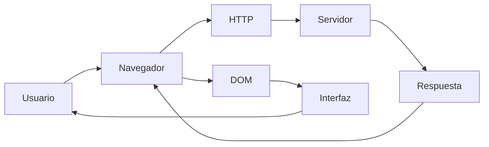
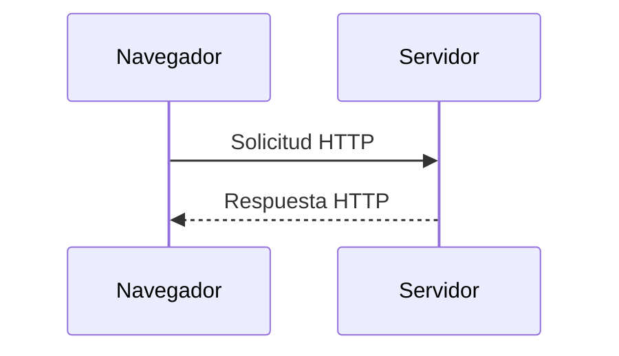
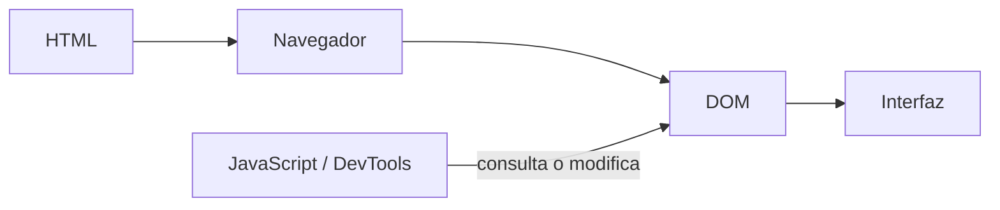
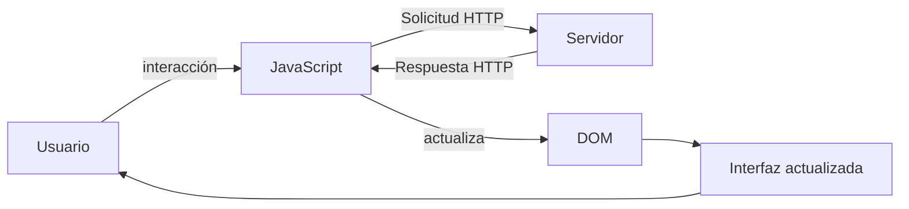
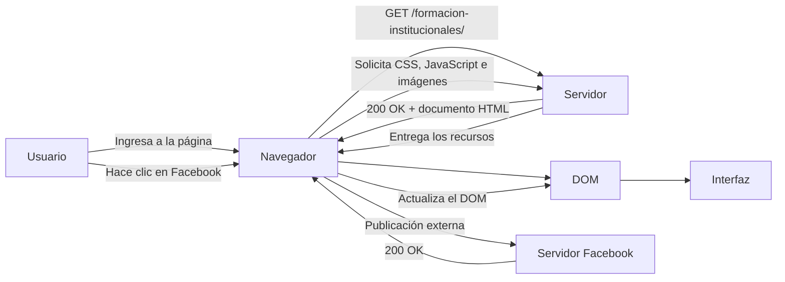

# Laboratorio 01 --- Análisis del funcionamiento de una aplicación web

> **Curso:** Aplicaciones y Servicios Web\
> **Modalidad:** Práctica de laboratorio\
> **Entrega:** Repositorio GitHub --- archivo `README.md`\
> **Evidencias:** Carpeta `evidencias/`

------------------------------------------------------------------------

## Objetivo de la práctica

Analizar el funcionamiento de una aplicación web real mediante las
herramientas de desarrollo del navegador, identificando los recursos
cargados, las solicitudes y respuestas HTTP, la estructura DOM y las
interacciones entre cliente y servidor.

## Resultado esperado

Al finalizar la práctica, el estudiante deberá poder reconstruir y
documentar el flujo observado entre:



> El diagrama anterior representa los **componentes que serán
> analizados**. El diagrama final de la práctica deberá ser construido
> por el estudiante a partir de sus propias observaciones.

------------------------------------------------------------------------

# 1. Preparación del entorno

1.  Ingrese a la aplicación web indicada por el docente.
2.  Abra las **herramientas de desarrollo** del navegador.
3.  Identifique las herramientas **Red / Network** y **Elementos /
    Elements**.
4.  Cree la siguiente estructura dentro del repositorio:

``` text
laboratorio-01/
├── README.md
└── evidencias/
```

El archivo `README.md` será el informe de la práctica. La carpeta
`evidencias/` contendrá las capturas utilizadas para sustentar los
resultados.

------------------------------------------------------------------------

# 2. Identificación de recursos de la aplicación

Abra la herramienta **Red / Network** y recargue completamente la
aplicación.

Observe las solicitudes generadas durante la carga e identifique como
mínimo **cinco recursos**, procurando seleccionar tipos diferentes:
documento HTML, CSS, JavaScript, imágenes, fuentes u otros.

## Resultados

Complete la tabla:

  Recurso                             Tipo          Dominio               Tamaño
  ---------                          ------         ---------             --------
 jquery.marquee.min.js?ver=7.0.4     script         www.itm.edu.co        (memory cache)    
 ubermenu.min.css?ver=3.8.3          stylesheet     www.itm.edu.co        (memory cache)      
 formatos-institucionales/           document       www.itm.edu.co        93.3 KB    
 leaf_icon1.png                      png            www.itm.edu.co        (memory cache)
 fa-brands-400.woff2                 font           use.fontawesome.com   (memory cache)

**Total de solicitudes observadas:** `___130__`

## Evidencia

Guarde una captura de la pestaña Network como:

``` text
evidencias/network.png
```

Inclúyala aquí:

``` markdown

```

### Análisis

**¿Por qué una sola URL puede generar múltiples solicitudes HTTP?**

> Escriba aquí su respuesta.
porque la pagina web esta compuesta por diferentes recursos, como los 
documentos HTML, CSS, JavaScript, imágenes, fuentes u otros.
------------------------------------------------------------------------

# 3. Análisis de una solicitud HTTP

En **Network**, seleccione una de las solicitudes realizadas por el
navegador, preferiblemente la correspondiente al documento principal.

Identifique la información solicitada a continuación.

  Elemento              Resultado
  --------------------- -----------
  URL                   https://www.itm.edu.co/formatos-institucionales/                
  Método HTTP           GET
  Código de estado      200 OK
  Host / dominio        www.itm.edu.co
  Tipo de recurso       document
  Tiempo de respuesta   768 ms

## Flujo que se está observando



## Evidencia

Guarde una captura de los detalles de la solicitud como:

``` text
evidencias/request.png
```

Inclúyala en el informe:

``` markdown

```

### Análisis

**¿Qué recurso solicitó el navegador?**

> Escriba aquí su respuesta.
El documento HTML principal de la pagina, del sitio web del ITM. 
------------------------------------------------------------------------

**¿Qué información permite determinar si la solicitud fue atendida
correctamente?**

> Escriba aquí su respuesta.
la informacion que permite determinar si la solicitud fue atendida 
correctamente es el codigo de estado HTTP.
------------------------------------------------------------------------

# 4. Inspección del DOM

Seleccione un elemento visible de la aplicación, por ejemplo:

-   un botón;
-   un título;
-   un enlace;
-   un campo de formulario;
-   un elemento del menú.

Utilizando **Elementos / Elements**:

1.  Localice el elemento dentro del DOM.
2.  Identifique la etiqueta HTML utilizada.
3.  Modifique temporalmente su contenido desde las herramientas de
    desarrollo.
4.  Observe el cambio producido en la interfaz.
5.  Registre la evidencia.

## Resultados

**Elemento seleccionado:** titulo: formatos institucionales
                           `----------------------------------`
**Etiqueta HTML:**  h1
                  `----------------------`
**Contenido original:** Formatos Institucionales
                        `----------------------------`

**Modificación realizada:** se cambio temporalmente el texto: formatos institucionales por: Laboratorio v-01
                            `----------------------------------------------------------------------------------`
El proceso observado puede representarse conceptualmente así:



## Evidencia

Guarde la captura como:

``` text
evidencias/dom.png
```

Inclúyala aquí:

``` markdown

```

### Análisis

**¿La modificación realizada sobre el DOM alteró permanentemente la
aplicación o los archivos almacenados en el servidor? Justifique.**

> Escriba aquí su respuesta.
No, la modificacion realizada sobre el DOM no altero permanentemente la 
aplicacion o los archivos almacenados en el servidor, por que la 
modificacion se realizo en el navegador del usuario y no en el servidor, 
por lo que al recargar la pagina, el contenido original se restablece.
------------------------------------------------------------------------

# 5. Análisis de una interacción dinámica

Regrese a **Network** y limpie las solicitudes registradas.

Realice una acción dentro de la aplicación que pueda generar una
interacción con el servidor, por ejemplo:

-   consultar;
-   buscar;
-   filtrar;
-   seleccionar una opción;
-   enviar información.

Observe si aparece una nueva solicitud en Network.

## Resultados

  Elemento                       Resultado
  ------------------------------ -----------
  Acción realizada               clic sobre el enlace de facebook 
  ¿Generó una nueva solicitud?   si
  URL solicitada                 https://www.facebook.com/tr/
  Método HTTP                    POST
  Código de estado               200 OK
  Tipo de respuesta              fetch

## Ciclo de interacción

Utilice este esquema únicamente como referencia conceptual para
interpretar lo observado:



## Evidencia

Guarde la captura como:

``` text
evidencias/interaccion.png
```

Inclúyala aquí:

``` markdown

```

### Análisis

**Explique la relación entre la acción realizada por el usuario y la
solicitud observada.**

> Escriba aquí su respuesta.
la accion realizada por el usuario, en este caso, hacer clic sobre 
el enlace de facebook, provoco una interaccion del navegador con un servidor
externo. Como resultado, se genero una solicitud HTTP mediante el metodo POST
hacia https://www.facebook.com/tr/. El servidor respondio con el codigo
200 OK, indicando que la solicitud fue procesada correctamente.
------------------------------------------------------------------------

# 6. Reconstrucción del flujo observado

A partir de **sus propias evidencias**, construya un diagrama Mermaid
que represente el funcionamiento de la aplicación analizada.

El diagrama deberá incluir, cuando corresponda:

`Usuario` · `Navegador` · `JavaScript` · `Solicitud HTTP` · `Servidor` ·
`Respuesta HTTP` · `DOM` · `Interfaz`

> **No copie los diagramas anteriores.** Esta sección debe representar
> el flujo que usted pudo comprobar durante la práctica.

Reemplace el siguiente bloque con su diagrama:



------------------------------------------------------------------------

# 7. Observado vs. inferido

Una herramienta de desarrollo permite observar una parte del sistema,
pero no necesariamente todo lo que ocurre en el servidor.

Clasifique sus hallazgos:

## Elementos observados directamente

- El navegador realizo una solicitud GET a `https://www.itm.edu.co/formatos-institucionales/` y recibio el codigo `200 OK`.
- Se observaron diferentes recursos cargados por la aplicacion, como documentos HTML, archivos CSS, JavaScript, imágenes y fuentes. 
- Al modificar un elemento desde la herramienta Elements, el contenido cambio temporalmente en la interfaz y desaparecio al recargar la pagina.

## Elementos inferidos

- Se infiere que el servidor del ITM procesa las solicitudes y genera o entrega los recursos solicitados por el navegador.
- Se infiere que el navegador utiliza el documento HTML, CSS y JavaScript reccibidos para contruir y actualizar la interfaz mediante el DOM.
- Se infiere que la solicitud a facebook corresponde a algun proceso de comunicacion o registro asociado con la interraccion realizada, aunque
  su procesamiento interno no puede comprobarse directamente desde las herramientas del navegador.

> No presente como observado un proceso interno que las herramientas del
> navegador no permitan comprobar directamente.

------------------------------------------------------------------------

# 8. Conclusiones

Redacte **tres conclusiones técnicas** derivadas de la práctica.

1. La inspeccion de las solicitudes permitio comprender que el navegador actua como intermediario entre el usuario y los servidores,
   realizando peticiones y procesando respuestas para mostrar el contenido de la aplicacion.
2. El analisis del DOM permitio comprobar que los elementos visibles de una pagina estan representados mediante una estructura HTML
   que puede ser inspeccionada y modificada temporalmente desde el navegador, sin afectar los archivos originales del servidor.
3. La practica permitio diferenciar entre la informacion que puede comprobarse desde el cliente y los procesos que ocurren internamente
   en el servidor, evitando asumir como hechos aquellos procedimientos que no pueden observarse directamente mediante las herramientas de desarrollo.

Las conclusiones deben explicar lo aprendido a partir de la evidencia y
no limitarse a describir las actividades realizadas.

------------------------------------------------------------------------

# 9. Entrega

La estructura final esperada es:

``` text
laboratorio-01/
├── README.md
└── evidencias/
    ├── network.png
    ├── request.png
    ├── dom.png
    └── interaccion.png
```

Antes de entregar, verifique:

-   [ ] El `README.md` se visualiza correctamente en GitHub.
-   [ ] Las imágenes se muestran dentro del README.
-   [ ] Se documentaron al menos cinco recursos.
-   [ ] Se analizó una solicitud HTTP.
-   [ ] Se identificó y modificó un elemento del DOM.
-   [ ] Se analizó una interacción de la aplicación.
-   [ ] El diagrama final corresponde a lo observado.
-   [ ] Se diferenciaron elementos observados e inferidos.
-   [ ] Se redactaron tres conclusiones técnicas.
-   [ ] Se realizó `commit` y `push` al repositorio.

------------------------------------------------------------------------

## Criterio de documentación

> **Las capturas son evidencia, no la respuesta.**

Cada evidencia debe estar acompañada por una explicación que indique
**qué se observó, qué significa y cómo se relaciona con el
funcionamiento de la aplicación web**.
